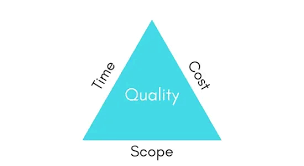
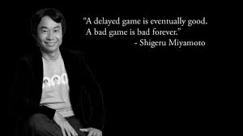

<!-- npx @marp-team/marp-cli@latest slides.md --html -w  -o index.html --theme theme.css -->

# Economics in the Game Industry

## - Aaron James

---

# The Triangle

This is whats called the Project Management triangle. Essentially, the quality of a product is determined by the combination of these 3 factors. To increase one, the others must decrease and vice-versa.
- Time
- Cost
- Scope

---
# Time

Some AAA companies will put out games and/or updates on a fixed schedule, a significant portion of the games industry is made up of indie developers working on side projects for ten years.

---
# Delays (Changing Time)

Easily the most public way to change the scope triangle, game delays give you more time to work on the game. Delays are more commonly seen for AAA games. Famously, Cyberpunk 2077 was delayed 3 times, for a total delay of eight months.   
[(0:50 - 2:20)](https://youtu.be/t1AStyYpBhw?si=r79Gn5iUZUiRCbwL&t=50)
<iframe width="560" height="315" src="https://www.youtube.com/embed/t1AStyYpBhw?si=r79Gn5iUZUiRCbwL&amp;start=50" title="YouTube video player" frameborder="0" allow="accelerometer; autoplay; clipboard-write; encrypted-media; gyroscope; picture-in-picture; web-share" referrerpolicy="strict-origin-when-cross-origin" allowfullscreen></iframe>

---
# Early Access (Changing Time)
Early Access takes some of the pressure off of developers since it is an explicitly unfinished version of the game being put into players hands.

Early access also has other benefits, such as 
- Immediete Income
- Player Feedback

Due to this, Early Access is mainly used by smaller indie studios with less resources.

---
# Cost

There are many costs associated with game development but it isn't much different then other forms of media.
- Assets (Art and Music)
- Labor (Dev Team, PR, Directors, etc.)
- Liscensing 
- Customer Support
  

---

# Scope

Scope includes all of the design for your game. Scoping includes
- The core gameplay loop
- 
- 